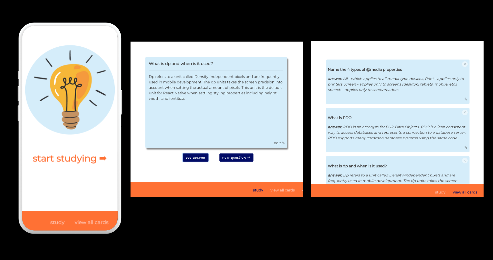

 

# CueCards: Your online study tool

## Table of contents

- [Description](#Description)
- [Technologies](#Technologies)
- [Usage-Installation](#Usage-Installation)
- [Demo](#Demo)
- [Credits](#credits)

## Description
Cuecards is an online study tool that allows you to make your own cuecards and quiz you on your understanding of the content. How it works:

 Site users have the option to 
1. Begin Studying: This prompts randomized questions from the database to be shown to the user on the screen. The 'view answer' button will show the answer in full so that the user can check their knowledge. 
The 'next question' button will show a new question.

2. View all Cards: This will show the complete index of questions entered into the database - sorted in alphabetical order

3. Add a new question: The user can add a new question at any time. Question entries must be entered with a corresponding answer.

Questions and answer can be editted at any time either from the card index or directly during studying.

CueCards is a responsive and mobile-friendly MERN stack application.

This concept was conceived during my technical interview preparations. I wanted a place where I could easily collect all potential questions and important facts while also being able to quiz myself on the knowledge. 

### Next Steps In Development

Next steps in development include creating individual user accounts with login/logout functionality.

This app is mobile-responsive and is easy to navigate on smaller screens. That said, I would like to explore the possibility of creating a React-Native version of this site specificaly for mobile devices.

## Technologies

This Project was built using:

- MongoDB
- Mongoose
- Node.js
- Express.js
- React.js
- JavaScript & JSX
- Bootstrap
- CSS

## Usage-Installation

To use this site, visit [www.ratethegords.ca](https://cuecards-aw22.herokuapp.com/)

## Credits

Built and Designed by Amy Wilford

